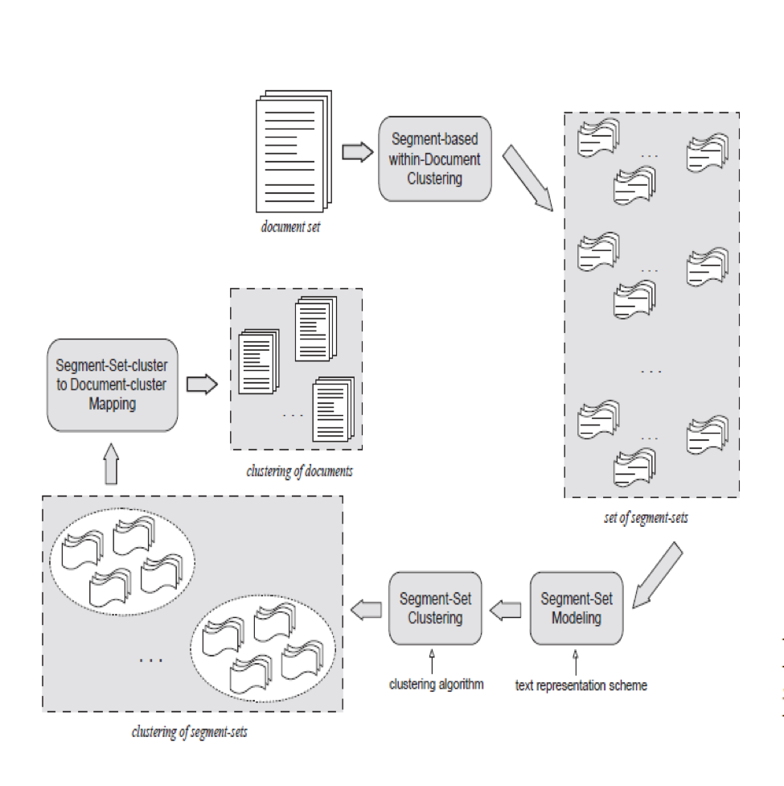
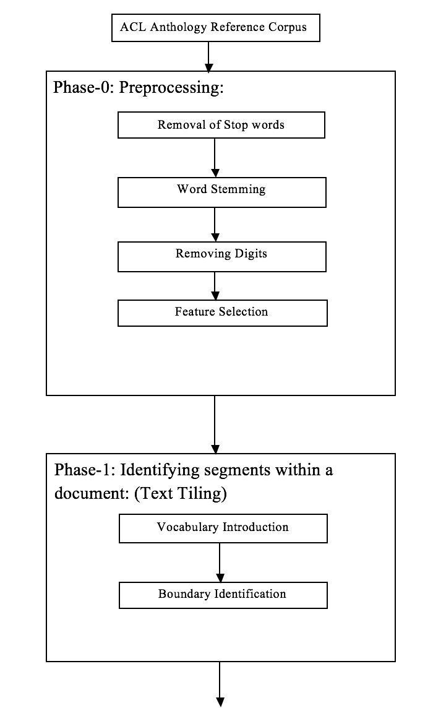
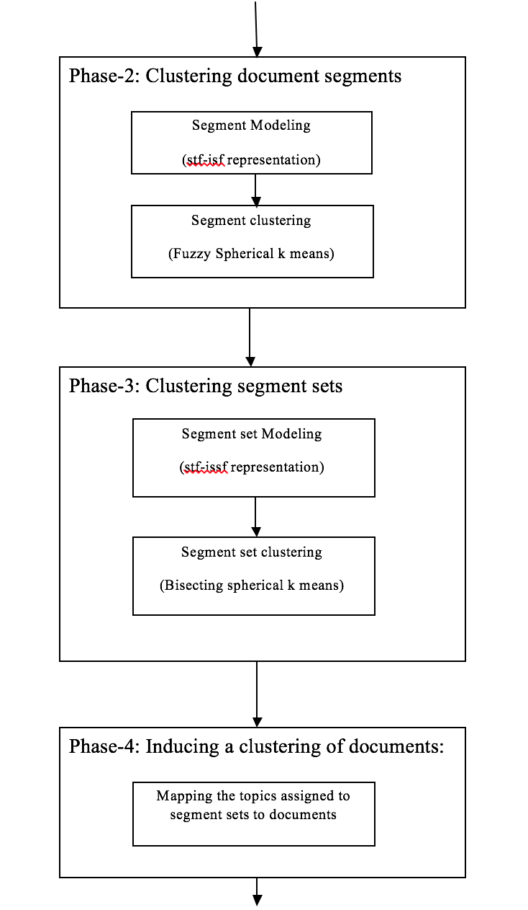
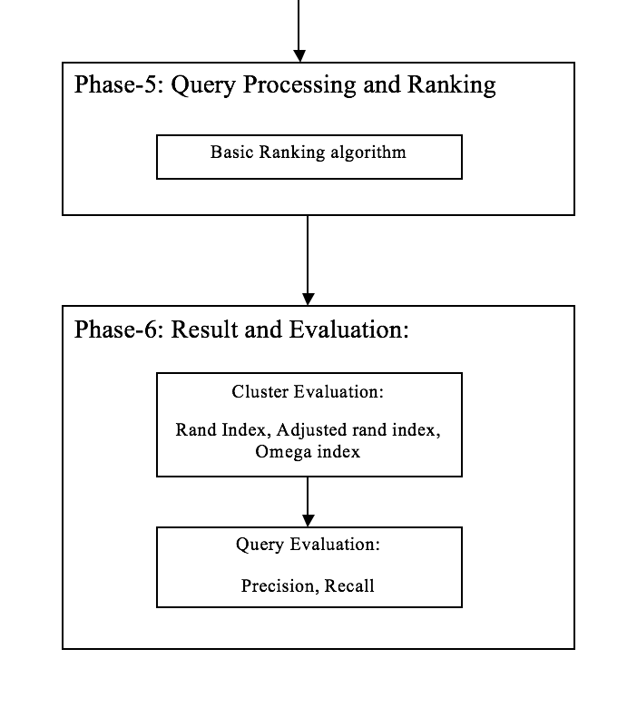

## Document Clustering
Document clustering and topic identification are well known problem in text mining. In case of research papers, many research papers contain sub topical information under the same time. Many sections in the research document contain background knowledge about the main topic. A document may contain information regarding multiple subtopics. All the existing methods used for document clustering assume document as an indivisible unit for text representation and similarity computation. These methods do not consider the underlying sub topics present in the corresponding document.
In the proposed problem, we need to cluster the acl dataset text documents using soft clustering algorithm. In soft clustering a document can belong to mutiple clusters according to its membership measure. To solve this problem, we propose a segment based approach by identifying the text segments that are coherent with respect to the underlying subtopics in the documents. First these segments are clustered within a document, which basically form segment sets. These segment sets belong to corresponding document, contain segments related to same topic. The segment set of all the documents are then clustered in a disjoint fashion. Then in the last phase these segment sets are mapped directly to the corresponding documents. Thus the segments corresponding to one document may belong to multiple clusters because of its underlying multi topic nature. For clustering within a document we have applied LDA where segments belonging to a single topic are appended together. Each Segment can at most be represented by 2 topics. Spherical K-means have been used for Segment-Set Clustering. Chi Square has been used to reduce dimension.LDA has been applied within a Cluster to identify topic and its Representative feature. Query Expansion has been done for better results. Some Internal and External Measure has been used for cluster Evaluation.

Improvement in Text Segmentation Algorithm:
The text segmentation algorithm is used in the 1st phase of the given clustering solution. By implementing text tiling algorithm the text is divided into multiple segments. Text tiling detects subtopic boundaries by analyzing patterns of lexical co-occurrence and distribution in the text. Terms that are discussing a particular subtopic tend to occur locally, and a switch to new subtopic is detected by ending of co-occurrence of a given set of terms and the beginning of the co-occurrence of another set of terms. All the pairs of adjacent blocks are compared by cosine similarity measure, and the resulting sequence of similarity values is examined in order to detect the boundaries between the coherent segments. At the end of the algorithm it normalizes the identified boundaries to the nearest paragraph breaks. The documents that are included in acl corpus have very less number of paragraph breaks. So the segment quality we are getting by basic algorithm was not so good and sometimes it’s unable to segment the input text. To solve this problem the boundary normalization has to be done according to the segment boundaries, not according to the paragraph breaks. So after modification the algorithm is giving the actual identified boundaries normalized to their nearest previous punctuation. By this we are getting actual segment boundaries.

